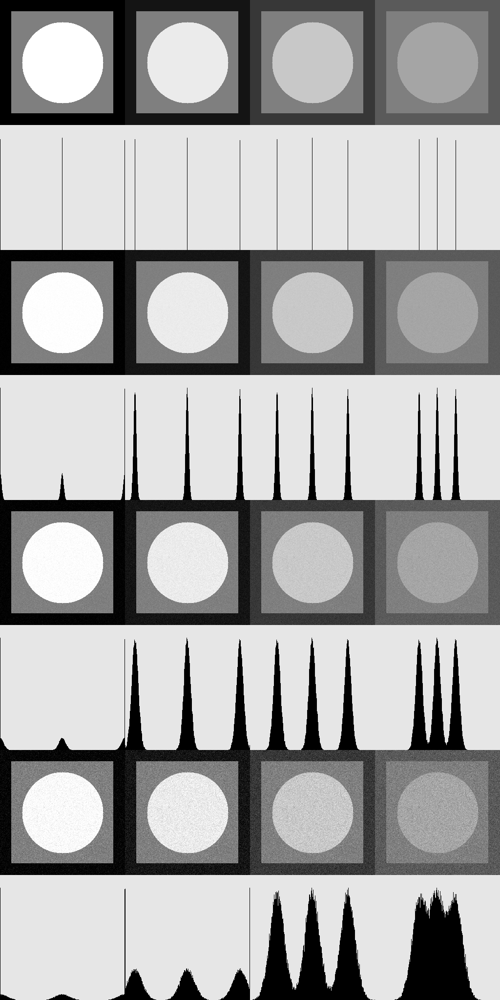

# Отчет по лабораторной №02 (гистаграммы и аддитивный шум)

#### Задание

1. написать функцию для генерации тестового изображения с тремя уровнями яркости
(256 - сторона изображения, 209 - сторона внутреннего квадрата, 83 - радиус круга)
1. написать функцию для рисования гистограммы яркости на квадратном растре со стороной 256
в виде столбиков шириной в 1px яркости 0 на фоне 230, нормировку сделать так, чтобы максимальное значение имело высоту 230
1. написать функцию зашумления (аддитивный нормальный несмещенный шум с заданным значением среднеквадратичного отклонения)
1. сгенерировать тестовые изображения для 4-х наборов уровней и склеить слева-направо:
    ```
    [0,127,255]
    [20,127,235]
    [55,127,200]
    [90,127,165]
    ```
1. сгенерировать зашумленные изображения и гистограммы, которые размещаются встык ниже тестового изображения
1. зашумление сделать для трех значений среднеквадратичного отклонения 3, 7, 15
1. склеить все изображения в одно
1. исследовать параметры шума в областях равной яркости


### Результат
1. Функция для генерации тестового изображения имеет следующую сигнатуру:
   ```cpp
   cv::Mat generateTestImage(int brightness1, int brightness2, int brightness3) {...}
   ```
   Функция генерирует изображение 256x256 с фоном `brightness1`, внутренним квадратом 209x209 с яркостью `brightness2`
   и кругом радиуса 83 с яркостью `brightness3`
2. Функция для рисования гистограммы яркости имеет следующую сигнатуру:
   ```cpp
   cv::Mat drawHistogram(const cv::Mat& img) {...}
   ```
   Что делаем в функции:
   * создаем изображение 256x256, на котором будем рисовать гистограмму
   * заполняем вектор `histogram` размера 256 и инициализированный нулями. `i`-ый элемент вектора содержит количество
     пикселей яркости `i` в исходном изображении
   * нормируем гистограмму к максимальной высоте 230
   * рисуем гистограмму
3. Функция зашумления имеет следующую сигнатуру:
   ```cpp
   void addNoise(cv::Mat& img, double sigma) {...}
   ```
   Что делаем в функции:
   * инициализируем генератор случайных чисел, инстанс `std::normal_distribution` с заданными медианой `0.0` и 
     стандартным отклонением `sigma`
   * добавляем случайное значение шума к каждому пикселю исходного изображения, следя за выходом за границы `[0, 255]`
4. В функции `generateAndDisplay` делаем следующее:
   * для каждого из 4-х значений среднеквадратичного отклонения из вектора `sigmas` (первое значение `0` - т.к. нужно 
   вывести так же гистограмму для незашумленного изображения):
      * для каждого из 4-х наборов уровней яркости вектора `brightness_levels`:
        * генерируем тестовое изображение
        * добавляем шум
        * рисуем гистограмму для зашумленного изображения
        * конкатенируем

### Результирующее изображение:


[//]: # (TODO: исследовать параметры шума)
