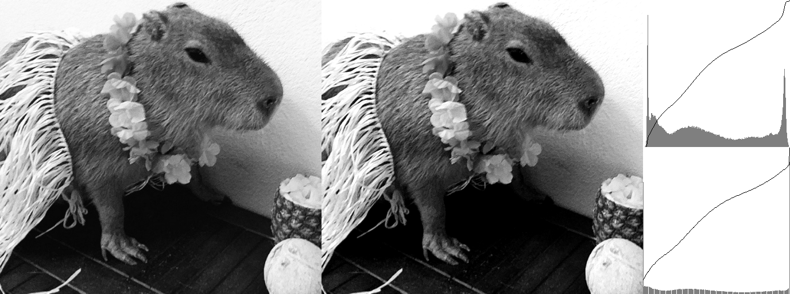
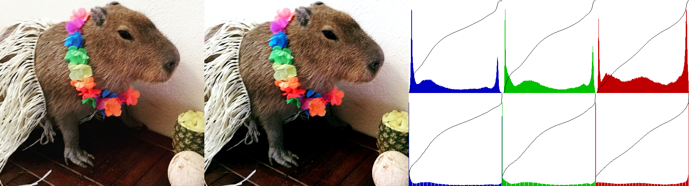

# Отчет по лабораторной работе №03 (Автоконтраст)

### Задание

1. написать функцию для автоконтрастирования по квантилям черного и белого
2. написать функции для автоконтрастирования цветного изображения (поканально и совместно)
3. оформить в виде консольного приложения (тип входного изображения определять автоматически)
4. подобрать тестовые изображения
5. написать короткий отчет

### Результат

1. Функция для вычисления гистограммы изображения имеет следующую сигнатуру:
   ```cpp
   std::vector<int> calc_histogram(const cv::Mat& img) {...}
   ```
   Функция возвращает вектор `histogram` из 256 элементов, где каждый элемент содержит количество пикселей соответствующей яркости от 0 до 255. Для цветного изображения яркость определяется усреднением по каналам RGB.

2. Функция для рисования гистограммы изображения имеет следующую сигнатуру:
   ```cpp
   cv::Mat draw_histogram(const std::vector<int>& histogram, const cv::Mat& img, const cv::Scalar color = cv::Scalar(127), bool gray = true) {...}
   ```
   В функции:
   * Создается изображение размером 256x256 для отображения гистограммы.
   * Вектор `histogram` нормируется к максимальной высоте 230 для визуализации.
   * Столбцы гистограммы строятся шириной 1 px.
   * Строится накопительная линия.
   * В зависимости от аргумента color возвращается либо CV_8UC1 изображение, либо CV_8UC3 с цветом соответствующего канала.

3. Функция применения автоконтраста имеет следующую сигнатуру:
   ```cpp
   cv::Mat autoContrast(const cv::Mat& img, const std::vector<int>& histogram, double black_quantile, double white_quantile) {...}
   ```
   В функции:
   * Определяются минимальные и максимальные пороговые значения яркости на основе квантилей черного и белого (`black_quantile` и `white_quantile`). Для этого последовательно накапливаются значения гистограммы, пока сумма не достигнет количества пикселей, соответствующего квантили.
   * Применяется линейное растяжение к пикселям изображения: значения ниже порогового минимума становятся черными, выше порогового максимума — белыми; остальные нормализуются в диапазон `[0, 255]`.

4. Основная функция `main` выполняет следующую логику:
   * Загружает исходное изображение и изменяет его размер до высоты 512 px.
   * В зависимости от выбранного режима `grayscale`, `joint`, или `per-channel`:
      * В режиме `grayscale` изображение переводится в градации серого, после чего применяется автоконтраст.
      * В режиме `joint` автоконтраст применяется к RGB-изображению как к одному каналу. Пороги по квантилям находятся по общей усредненной гистограмме яркости, а затем автоконтраст с заданными порогами применяется ко всем каналам.
      * В режиме `per-channel` пороги и автоконтраст определяются отдельно для каждого канала RGB.
   * Создает итоговое изображение путем горизонтальной конкатенации исходного изображения, обработанного изображения и их гистограмм.

### Примеры результирующих изображений:
* `black_quantile = 0.1; white_quantile = 0.9; mode = grayscale`

* `black_quantile = 0.1; white_quantile = 0.9; mode = per-channel`

* `black_quantile = 0.1; white_quantile = 0.9; mode = joint`


* `black_quantile = 0.2; white_quantile = 0.8; mode = grayscale`

* `black_quantile = 0.2; white_quantile = 0.8; mode = per-channel`

* `black_quantile = 0.2; white_quantile = 0.8; mode = joint`


* `black_quantile = 0.3; white_quantile = 0.7; mode = grayscale`

* `black_quantile = 0.2; white_quantile = 0.8; mode = per-channel`

* `black_quantile = 0.2; white_quantile = 0.8; mode = joint`


### Выводы

При применении автоконтраста изображение становится более контрастным, а гистограммы сужаются к краям диапазона интенсивности. В режиме `grayscale` и `joint` изменение распространяется на все изображение сразу, делая контрастность равномерной для всех каналов. В режиме `per-channel` заметно, что контраст корректируется для каждого канала отдельно, что может привести к изменению цветового баланса.
