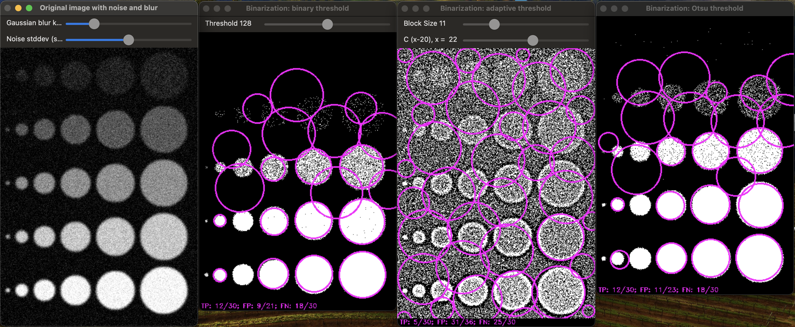
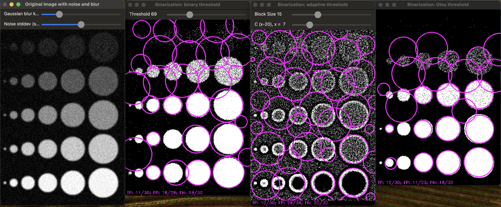
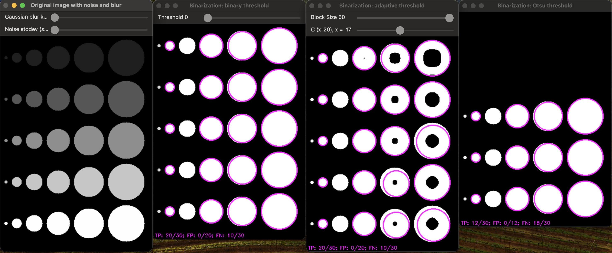

# Отчет по лабораторной работе №04 (бинаризация и простое детектирование объектов)

### Задание

1. написать функцию для генерации тестового изображения (количество объектов интереса, диапазон размеров, значений контраста и степени размытости - параметры)
1. написать несколько вариантов бинаризации (параметризованной)
1. предусмотреть режим визуальной настройки параметров бинаризации (движки в GUI)
1. написать функционал для детектирования
1. написать функционал для оценки качества

### Результаты

1. **Генерация тестового изображения**
   Функция `generateTestImage` создает изображение с сеткой окружностей разного радиуса и яркости, что позволяет тестировать различные параметры бинаризации и выявлять их влияние на детекцию окружностей.

2. **Наложение шума и размытие**
   Шум добавляется с помощью функции `addNoise`, а размытие – через `applyBlurAndNoise`, что имитирует реальные искажения и позволяет оценить устойчивость детекции.

3. **Методы бинаризации**
   - `applyBinarization`: Применяет классическую пороговую бинаризацию.
   - `applyAdaptiveBinarization`: Использует адаптивную бинаризацию с настройкой параметров блока. В отличие от классической пороговой бинаризации, здесь порог определяется локально для каждого пикселя. Значение порога для каждого пикселя рассчитывается на основе среднего или медианного значения интенсивности в пределах заданного блока (окрестности пикселя)
   - `applyOtsuBinarization`: Определяет оптимальный порог с помощью метода Отсу для автоматической бинаризации. Метод Отсу автоматически определяет оптимальный порог для бинаризации, минимизируя внутриклассовую дисперсию пикселей. Алгоритм анализирует гистограмму изображения, разбивая его на два класса – фон и объекты – так, чтобы различие между ними было максимальным. Этот подход подходит для изображений с выраженным двухклассным разделением и позволяет корректно отделить объекты от фона

4. **Детекция и оценка точности**
   Функция `detectAndEvaluateCircles` осуществляет детекцию окружностей методом Хафа и оценивает качество результата. Метрики TP, FP и FN:
    * True Positive: корректно найденные окружности
    * False Positive: ложные срабатывания
    * False Negative: пропущенные окружности

    Если расстояние между центрами окружностей меньше порогового значения, определенного через коэффициент IoU (Intersection over Union), то обнаруженная окружность считается правильной

### Примеры изображений

### Выводы

Использование различных методов бинаризации показывает, что адаптивная и метод Отсу более эффективны при наличии шума. Метод бинаризации должен выбираться с учетом свойств изображения, так как это влияет на точность и полноту детекции окружностей.
